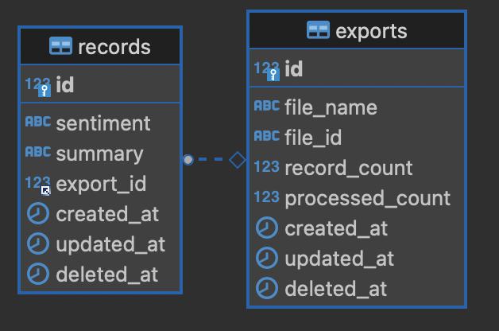

# Sentiment Analysis Tech Support

## Overview

The **Sentiment Analysis Tech Support** project provides a solution for analyzing customer feedback through sentiment analysis. It consists of a backend API built with FastAPI and a frontend web application built with React.js with Vite. This application allows users to upload feedback in CSV format, analyze its sentiment, and view results in a structured format.

## Features

- **CSV Upload**: Upload customer feedback in CSV format.
- **Sentiment Analysis**: Analyze sentiment using an external sentiment analysis API.
- **Results Export**: Download results in CSV format.
- **Pagination**: Navigate through lists of exports and records.
- **Visualization**: View sentiment distribution and key themes through charts.

## Tech Stack

- **Backend**: FastAPI
- **Frontend**: ReactJS with Vite
- **Database**: MySQL with SQLAlchemy
- **Message Queue**: RabbitMQ
- **Sentiment Analysis**: Groq API
- **Visualization**: Chart.js

## Getting Started

### Prerequisites

- Python 3.8 or higher
- Node.js 14.x or higher
- Mysql
- RabbitMQ

## Initial

1. Create a `.env` from `.env.example` file in the root directory with the following content:
```env
    GROQ_API_KEY=
    RABBITMQ_HOST=localhost
    RABBITMQ_PORT=5672
    DB_USER=user
    DB_PASSWORD=password
    DB_NAME=sentiment
    DB_PORT=3306
    DB_HOST=localhost
```

2. For running setup with docker compose
```bash
    make init
    cd client 
    npm run dev
```

## Database and RabbitMQ

1. To start using rabbitmq and mysql in docker compose:
    ```bash
    make rabbitsql
    ```

2. Create a database named sentiment and generate tables using schema.sql file.

3. Queue will generated automatically on running the worker server.

### Schema



### Backend Setup


1. Set up a virtual environment and install dependencies:
    ```bash
    make init
    ```

2. Create a `.env` from `.env.example` file in the root directory with the following content:
    ```env
    GROQ_API_KEY=
    RABBITMQ_HOST=localhost
    RABBITMQ_PORT=5672
    DB_USER=user
    DB_PASSWORD=password
    DB_NAME=sentiment
    DB_PORT=3306
    DB_HOST=localhost
    ```

3. Run the FastAPI API server:
    ```bash
    make rnapi
    ```

4. Run the FastAPI worker server:
    ```bash
    make rnwr
    ```

### Frontend Setup

1. Navigate to the frontend directory:
    ```bash
    cd frontend
    ```

2. Install dependencies:
    ```bash
    npm install
    ```

3. Create a `.env.local` file in the frontend directory with the following content:
    ```env
    VITE_BACKEND_URL=http://localhost:8081/api
    ```

4. Run the ReactJS development server:
    ```bash
    npm run dev
    ```

## Swagger

Open http://localhost:8081/docs to open swagger docs

## Frontend

- **Upload Page**: Allows users to upload a CSV file.
- **Download Export**: Allows users to download the sentiment analysis of feedback.
- **Visualization**: Provides charts and graphs of sentiment analysis results.

## Acknowledgements

- FastAPI
- React.js with Vite
- Docker Compose
- Chart.js
- RabbitMQ
- MySQL
- Groq API
