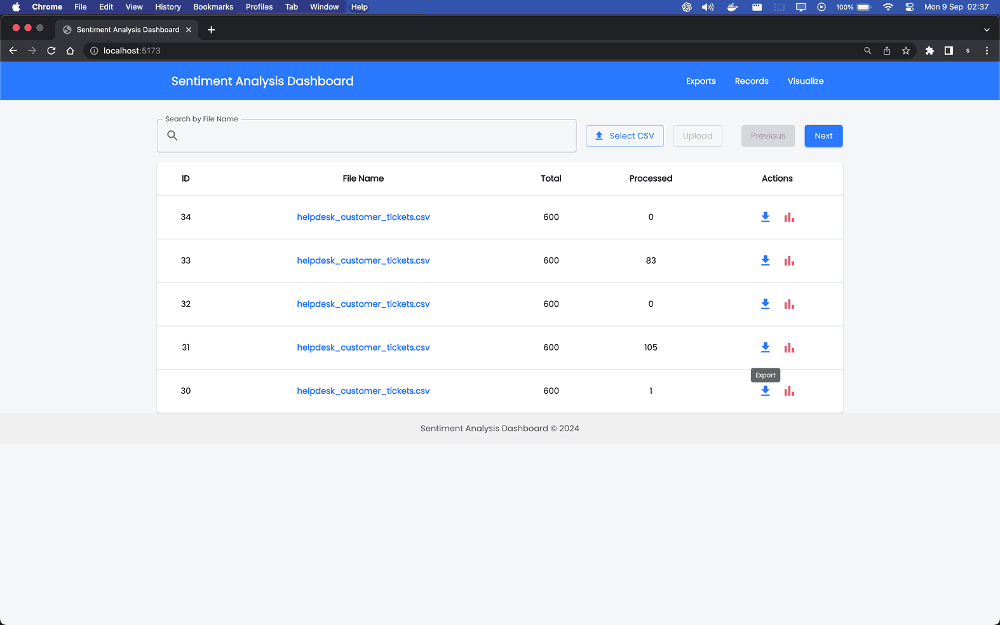
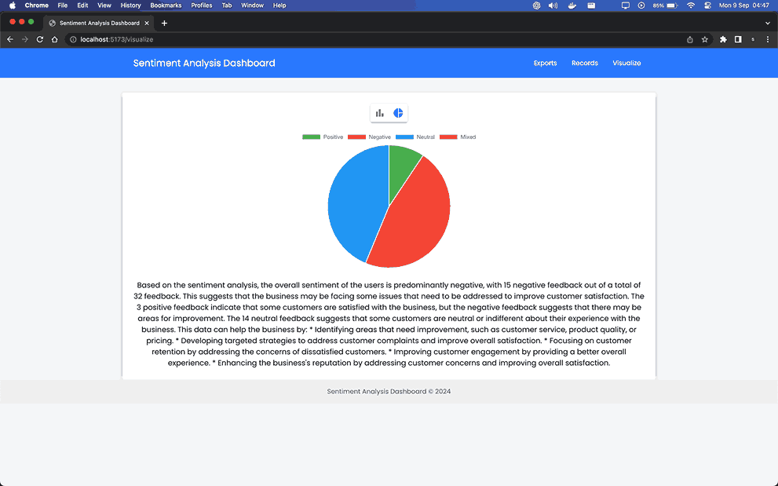
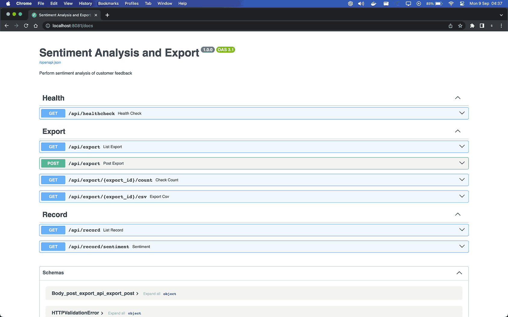

# Sentiment Analysis Tech Support

## Overview

The **Sentiment Analysis Tech Support** project provides a solution for analyzing customer feedback through sentiment analysis. It consists of a backend API built with FastAPI and a frontend web application built with React.js with Vite. This application allows users to upload feedback in CSV format, analyze its sentiment, and view results in a structured format.

## Features

- **CSV Upload**: Upload customer feedback in CSV format.
- **Sentiment Analysis**: Realtime Analyze sentiment using an external sentiment analysis API.
- **Results Export**: Download results in CSV format.
- **Visualization**: View sentiment distribution and key themes through charts.

## Screenshots

### Export page


### Record page


### Visualization page


### Visualization page


## Tech Stack

- **Backend**: FastAPI
- **Frontend**: ReactJS with Vite
- **Database**: MySQL with SQLAlchemy
- **Message Queue**: RabbitMQ
- **Sentiment Analysis**: Groq API
- **Visualization**: Chart.js
- **Realtime**: Websockets

## Getting Started

### Prerequisites

- Python 3.8 or higher
- Node.js 20.0x or higher
- Docker
- Docker Compose
- make - GNU make utility to maintain groups of programs

## Initial

1. Create a `.env` from `.env.example` file in the root directory with the following content:
```env
    GROQ_API_KEY=
    SOCKET_URL=http://websocket:8083
    RABBITMQ_HOST=rabbitmq
    RABBITMQ_PORT=5672
    DB_USER=user
    DB_PASSWORD=password
    DB_NAME=sentiment
    DB_PORT=3306
    DB_HOST=mysql
```

2. Create a `.env` from `.env.example` file in the client/ directory with the following content:
```env
    VITE_BACKEND_URL=http://localhost:8081/api
    VITE_SOCKET_URL=ws://localhost:8083
```

3. For running setup with docker compose
```bash
    make init
    nvm use 20.11.1
    cd client
    npm install
```

## Database and RabbitMQ

1. To launch DB and RabbitMQ, optional as it will always launch with other services:
```bash
    make rabbitsql
```

2. Create a database named sentiment and generate tables using init.sql file.

3. Queue will generated automatically on running the worker service.

4. To open rabbitmq UI. Go to: http://localhost:15672. Username and Password is guest.

### Schema


### Backend Setup


1. To run backend microservices after setting up .env in root folder:
    ```bash
    make dev
    ```

2. Create a `.env` from `.env.example` file in the root directory with the following content:
    ```env
    GROQ_API_KEY=
    RABBITMQ_HOST=rabbitmq
    RABBITMQ_PORT=5672
    DB_USER=user
    DB_PASSWORD=password
    DB_NAME=sentiment
    DB_PORT=3306
    DB_HOST=mysql
    ```

### Frontend Setup

1. Run the ReactJS development server:
    ```bash
    npm run dev
    ```

## Swagger

Open http://localhost:8081/docs to open swagger docs.




## Acknowledgements

- FastAPI
- React.js with Vite
- Docker Compose
- Chart.js
- RabbitMQ
- MySQL
- Groq API
- Websockets
